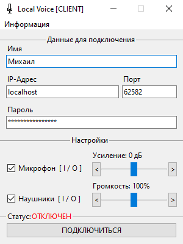

# Local Voice [CLIENT]

Бесплатный голосовой чат с открытым исходным кодом, разделенный на серверную и клиентскую части:
1. [**Клиент**](https://github.com/x2DFox/local-voice-client/releases/latest) — нужен для подключения пользователя к серверу в локальной сети или через интернет.
2. [**Сервер**](https://github.com/x2DFox/local-voice-server/releases/latest) — разворачивается на отдельном хостинге или на компьютере одного из пользователей в сети и принимает/передает данные, полученные от клиентов.

> [!WARNING]
> **Обратная совместимость между релизами** возможна, но не гарантируется и не поддерживается. Для корректной работы используйте только последние версии клиента и сервера.

> [!CAUTION]
> **Шифрование не реализовано**. Пароль и аудио передаются в открытом виде независимо от того, локальная это сеть или публичный адрес. Если сервер доступен из интернета — любой сможет подслушать разговор и узнать пароль.



# Системные требования

- 🐍 Python 3.12
- 🖥️ Windows 10
- 🛠️ Linux/MacOS: работоспособность не проверялась

> [!TIP]
> При желании код Local Voice можно адаптировать под более ранние версии Windows и Python — лицензия BSD 3-Clause это позволяет, и такие форки только приветствуются.

# Установка

1. Скачайте последнюю версию [клиента](https://github.com/x2DFox/local-voice-client/releases/latest).
2. Распакуйте архив в удобную папку.
3. Запустите `local-voice-client.exe`.

# Использование

Введите свое имя, а также IP-адрес, порт и пароль, полученные от сервера, в интерфейсе программы. При подключении к серверу последний также увидит ваш IP — это безопасно, если ваш IP "серый" (в большинстве случаев) или вы используете виртуальную локальную сеть, например, Hamachi.

# Зависимости (для запуска из исходников)

## Автоматическая установка

Клиентская часть использует PyAudio и NumPy, которые можно установить автоматически:

```bash
pip install -r requirements.txt
```

## Ручная установка

```bash
pip install pyaudio
pip install numpy
```

# Сборка

Помимо использования уже скомпилированного исполняемого файла, вы можете собрать его вручную командой:

```bash
pyinstaller --clean --noconsole --onedir --name local-voice-client --contents-directory library --icon icon.ico main.py
```

# Лицензия
[BSD 3-Clause](https://github.com/x2DFox/local-voice-client/blob/main/LICENSE)
